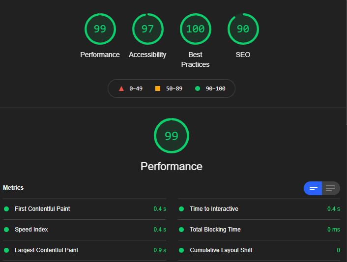
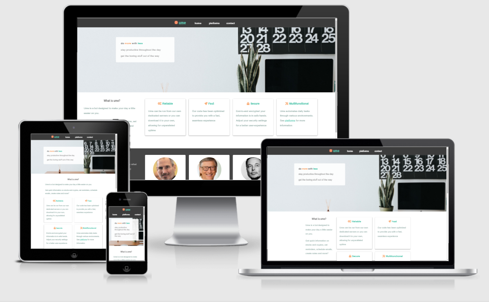
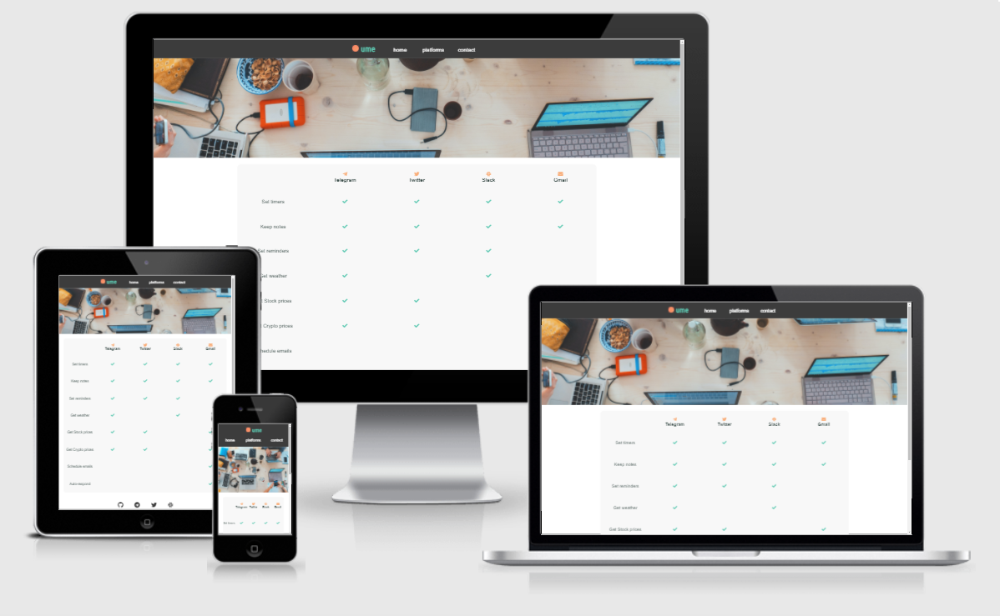
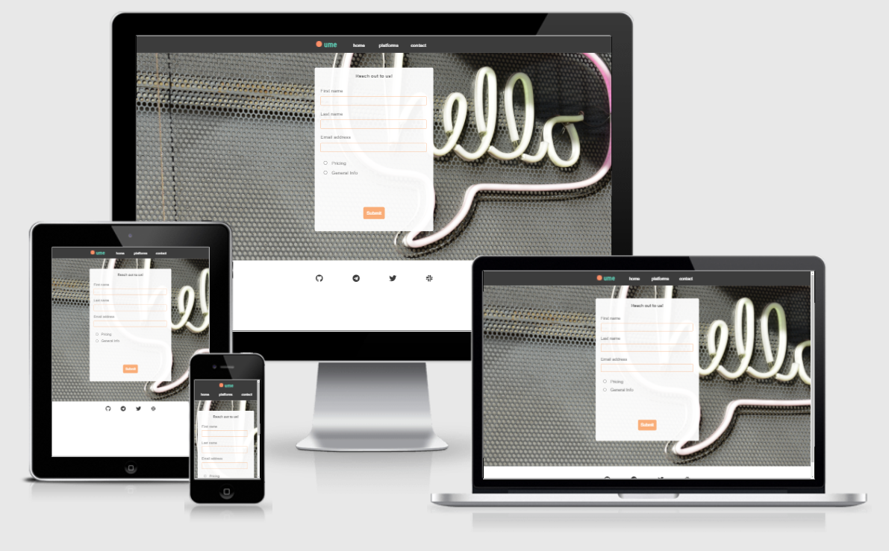

# ume**bot**shi

This website's aim is to show what ume is capable of with its implemented features and what's coming down the pipeline.

![amiresponsive-image]

## Features

## Skeleton
- Home
    - hero
    - why ume
- Platforms
    - ume's philosphy
    - platform cards with features
- About
    - about the author
    - other projects
- Contact
    - form

------

## Relevant Social Links
- Github
- Twitter
- Telegram
- Slack?
 
## Testing

### Validator Results
- HTML
    - No errors were found
- CSS
    - No errors were found
- Accessibility

- Responsiveness

## Deployment
Deployed using GitHub pages using steps below:
- Click Settings in the GitHub repository
- Go to Pages and select main branch from the dropdown menu
- Click save to allow GitHub to deploy the website

Live project can be seen [here](https://khalanar.github.io/ci-p1/)

## Credits

### Content
- Code for aaa from bbb

### Media
- Hero [image](https://unsplash.com/photos/PypjzKTUqLo) by [Austin Distel](https://unsplash.com/@romanbozhko) at [unsplash](https://unsplash.com)

## Changelog
**03 sept 2021** Created basic readme
