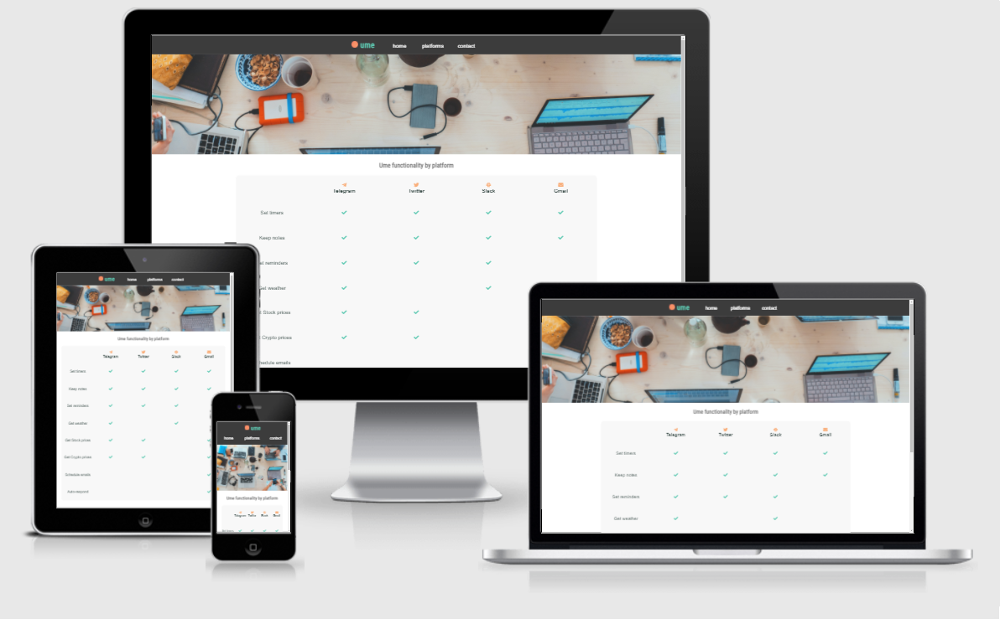

# ume**bot**shi

View the live project [here](https://khalanar.github.io/ume-web/)

This website's aim is to show what the bot **ume** is capable of doing in different platforms. There's sections on what to expect from this bot and testimonials, along with a contact form if users want more information.

## User Experience (UX)
- User Stories
    - First Time Visitor Goals
        - As a First Time Visitor, I want to easily understand the main purpose of the site and learn more about the organisation.
        - As a First Time Visitor, I want to be able to easily navigate throughout the site to find content.
    - Returning Visitor Goals
        - As a Returning Visitor, I want to find information about the bot
        - As a Returning Visitor, I want to find the best way to get in contact with the organisation with any questions I may have.
        - As a Returning Visitor, I want to find Social Media links.

## Design
- Colour Scheme
    - The two main colours used are reminiscent of a umeboshi and a green shiso leaves, japanese food which inspired this bot's name
    - Roboto and variations provide a clean but modern aesthetic to the page.
    
## Imagery
Big hero images are placed in each screen to make them visually engaging and provide information on what the page contains

## Features
This fully responsive website shows information for:
- What is **ume** and why should you use it
- Testimonials
- Functionality by Platform
- Social Media links

## Wireframes
- Home
    - Hero
    - What is ume
    - Testimonials
- Platforms
    - Hero
    - Platform table with bot features
- Contact
    - Hero
        - Form

### Index

### Platforms

### Contact


### Relevant Social Links
- Github
- Twitter
- Telegram
- Slack
 
---

## Technologies
### Languages
- [HTML5](https://en.wikipedia.org/wiki/HTML5)
- [CSS3](https://en.wikipedia.org/wiki/CSS)

### Other Programs
- [Affinity Designer](https://affinity.serif.com/en-gb/) - Vectorial logos
- [Git](https://git-scm.com/) - Version control and deployment
- [Balsamiq](https://balsamiq.com/) - Design wireframes
- [Visual Studio Code](https://code.visualstudio.com/) - IDE

---

## Testing

### HTML
[HTML validator](https://validator.w3.org/)
    - No errors were found
    - 1 Warnings ignored - Hero-platforms does not have h1, which is intentional
### CSS
[CSS Validator](https://jigsaw.w3.org/css-validator/)
    - No errors were found
### Accessibility
Lighthouse


### Responsiveness




### Further Testing
Tested on Google Chrome, Internet Explorer, Microsoft Edge, Safari, Opera, Firefox and Brave.
Viewed on Desktop, Laptop, iPhone12, Nexus5X, Microsoft Surface Pro 4, Sony Xperia Z2.
Friends and family members were asked to review the site and documentation to point out any bugs and/or user experience issues.

### Testing User Stories from User Experience (UX) Section
-   #### First Time Visitor Goals
    1. As a First Time Visitor, I want to easily understand the main purpose of the site and learn more about the bot.
        1. Upon entering the site, users are greeted with a clean and readable navigation bar to go to the page of their choice. Underneath there is a Hero Image with a quick 5cent of what this bot is about.
        2. The main points are made immediately below the hero image
        3. The user can scroll down to see testimonials or navigate to the other pages

    2. As a First Time Visitor, I want to be able to easily be able to navigate throughout the site to find content.
        1. The site has been designed to be fluid and never to entrap the user. At the top of each page there is a clean navigation bar, each link describes what the page they will end up at clearly.

-   #### Returning Visitor Goals

    1.  As a Returning Visitor, I want to find information about the bot
        1. Link to platforms is clearly shown in the banner message.

    2. As a Returning Visitor, I want to find the best way to get in contact with the organisation with any questions I may have.
        1. The navigation bar clearly highlights the "Contact Us" Page.
        2. Here they can fill out the form on the page or are told that alternatively they can message the organisation on social media.
        3. The footer contains links to the organisations Facebook, Twitter and Instagram page as well as the organization's email.
        4. Whichever link they click, it will be open up in a new tab to ensure the user can easily get back to the website.

    3. As a Returning Visitor, I want to find Social Media links.
        1. Social Links can be found at the footer of every page and will open a new tab for the user and more information can be found in them.

---

## Deployment

### GitHub Pages

The project was deployed to GitHub Pages using the following steps...

1. Log in to GitHub and locate the [GitHub Repository](https://github.com/Khalanar/ume-web)
2. At the top of the Repository, click "Settings".
3. Scroll down the Settings page and click "Pages".
4. Under "Source", click "None" and select "Master Branch", the page will automatically refresh.
6. Scroll back down through the page to locate the now published site [link](https://khalanar.github.io/ume-web/) in the "GitHub Pages" section.

### Forking the GitHub Repository

By forking the GitHub Repository we make a copy of the original repository on our GitHub account to view and/or make changes without affecting the original repository by using the following steps...

1. Log in to GitHub and locate the [GitHub Repository](https://github.com/Khalanar/ume-web)
2. At the top of the Repository (not top of page) just above the "Settings" Button on the menu, locate the "Fork" Button.
3. You should now have a copy of the original repository in your GitHub account.

### Making a Local Clone

1. Log in to GitHub and locate the [GitHub Repository](https://github.com/Khalanar/ume-web)
2. Under the repository name, click "Clone or download".
3. To clone the repository using HTTPS, under "Clone with HTTPS", copy the link.
4. Open Git Bash
5. Change the current working directory to the location where you want the cloned directory to be made.
6. Type `git clone`, and then paste the URL you copied in Step 3.

```
$ git clone https://github.com/Khalanar/ume-web
```

7. Press Enter. Your local clone will be created.

```
$ git clone https://github.com/Khalanar/ume-web
> Cloning into `CI-Clone`...
> remote: Counting objects: 10, done.
> remote: Compressing objects: 100% (8/8), done.
> remove: Total 10 (delta 1), reused 10 (delta 1)
> Unpacking objects: 100% (10/10), done.
```

Click [Here](https://help.github.com/en/github/creating-cloning-and-archiving-repositories/cloning-a-repository#cloning-a-repository-to-github-desktop) to retrieve pictures for some of the buttons and more detailed explanations of the above process.

---

## Credits
### Media
- Hero Index [image](https://unsplash.com/photos/PypjzKTUqLo) by [Roman Bozhko](https://unsplash.com/@romanbozhko) at [unsplash](https://unsplash.com)
- Hero Platforms [image](https://unsplash.com/photos/SYTO3xs06fU) by [Marvin Meyer](https://unsplash.com/@marvelous) at [unsplash](https://unsplash.com)
- Hero Contact [image](https://unsplash.com/photos/WHUDOzd5IYU) by [Adam Solomon](https://unsplash.com/@solomac) at [unsplash](https://unsplash.com)

## Changelog
- Fully deployed on 14 Aug 2021